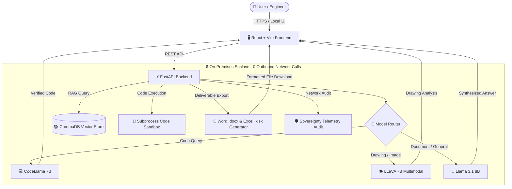

# 🛡️ Sovereign AI Workbench
> **On-Premises, Air-Gapped AI Assistant & Decision Enclave for Sensitive Industrial & PSU Environments**


---

## 📌 Executive Summary

High-security organizations—such as **Refineries, PSUs, Defense Units, and Government Offices**—generate massive amounts of sensitive knowledge work: engineering calculations, Piping & Instrument Diagrams (P&IDs), vendor negotiations, board presentations, and confidential correspondence. 

Due to strict data residency policies, **none of this material can leave the premises** or be sent to public cloud AI services (Claude, OpenAI, etc.). 

**Sovereign AI Workbench** solves this by providing a completely self-hosted, air-gapped AI enclave running 100% on internal hardware. It features **task-aware multi-model routing**, **document retrieval (RAG)**, **code sandbox execution**, **scanned drawing vision analysis**, and **real deliverable export (Word/Excel)**—all backed by verifiable 0-external-call network auditing.

---

## 🏛️ System Architecture



---

## ✨ Key Technical Capabilities

### 1. 🔀 Task-Aware Multi-Model Auto-Selection
The system automatically routes requests to the optimal local model based on intent detection:
* **Coding & Technical Tasks** $\rightarrow$ `codellama:7b`
* **Engineering Drawings & Visual Scans** $\rightarrow$ `llava:7b`
* **Document Summarization & General Q&A** $\rightarrow$ `llama3.1:8b`
* Includes seamless fallback to the primary model if a secondary model isn't yet pulled.

### 2. 📝 Production Deliverable Generation (Word & Excel)
Instead of plain text chat outputs, the workbench generates formal enterprise deliverables:
* **Word (`.docx`) Approval Notes**: Corporate-formatted memos with classification headers, metadata tables, executive summaries, bulleted findings, and signature blocks.
* **Excel (`.xlsx`) Analytical Reports**: Styled spreadsheets with auto-formatted column headers, borders, and numerical alignment.

### 3. 🧪 Isolated Code Sandbox Execution
* Executes generated Python calculations or scripts in a local, restricted subprocess environment.
* Features a 10-second hard timeout limit, output stream capturing (`stdout`/`stderr`), and forbidden import security filters (`os.system`, `subprocess`, etc.).

### 4. 👁️ Multimodal Vision & Scanned Document OCR
* **Scanned PDF Support**: Per-page OCR fallback using Tesseract v5.5.3 to extract text from scanned inspection reports or mixed PDFs.
* **Engineering Drawings & P&IDs**: Multimodal visual analysis powered by `llava:7b` to inspect equipment labels, valves, and diagrams directly on-device.

### 5. 🛡️ Verifiable Network Sovereignty Audit
* Real-time network telemetry logging records every internal API call.
* Live UI dashboard displays proof of **0 external outbound requests**, guaranteeing zero data leakage to public cloud networks.

### 6. 📚 Role-Based Knowledge Base (RAG with ACL)
* Indexes SOPs, manuals, and past reports into a local **ChromaDB** vector store using `all-MiniLM-L6-v2` embeddings.
* Strict Access Control Lists (ACL) enforce role-specific document visibility across 5 predefined user personas.

---

## 👥 Demo User Personas & Credentials

All accounts are pre-configured in the local database—no external signup required:

| Username | Password | Role | Document Access Scope |
|---|---|---|---|
| `admin` | `admin` | Admin | Full Access (All confidential documents & settings) |
| `supervisor` | `supervisor` | Supervisor | Management, Supervisor & Operator documents |
| `operator` | `operator` | Operator | Technical manuals & equipment SOPs |
| `viewer` | `viewer` | Viewer | Read-only general documents |
| `manager` | `manager` | Manager | Executive reports & department files |

---

## 🚀 Quick Start Guide

### Prerequisites
* **Python 3.10+**
* **Node.js 18+**
* **Ollama** installed locally ([ollama.com](https://ollama.com))
* **Tesseract OCR** (for scanned document processing)

### 1. Start Local Ollama Models
```bash
ollama serve
ollama pull llama3.1:8b
ollama pull codellama:7b
```

### 2. Backend Setup & Startup
```bash
cd backend

# Create & activate virtual environment (Windows PowerShell)
python -m venv .venv
.venv\Scripts\Activate.ps1

# Install dependencies
pip install -r requirements.txt

# Start backend server (runs on http://127.0.0.1:8000)
uvicorn app.main:app --reload --port 8000
```

### 3. Frontend Setup & Startup
```bash
cd frontend

# Install dependencies
npm install

# Start Vite dev server (runs on http://localhost:5173)
npm run dev
```

---

## 📡 API Endpoint Reference

| Method | Endpoint Path | Description |
|---|---|---|
| `POST` | `/api/chat` | Main query endpoint with multi-model routing & RAG context |
| `POST` | `/api/documents` | Uploads and asynchronously indexes PDF/image documents |
| `GET` | `/api/documents/{id}` | Polls background indexing status (`processing` $\rightarrow$ `ready`) |
| `POST` | `/api/generate/approval-note` | Generates downloadable Word (`.docx`) approval notes |
| `POST` | `/api/generate/excel-report` | Generates downloadable Excel (`.xlsx`) analytical spreadsheets |
| `POST` | `/api/sandbox/run` | Executes Python code in isolated sandbox subprocess |
| `GET` | `/api/telemetry/network-calls` | Returns network sovereignty audit logs (verifies 0 external calls) |

---

## 🧪 Test Suite & Verification

The project includes an automated test suite verifying model routing, document parsing, RAG retrieval, code execution sandbox, deliverables generation, and network telemetry auditing.

```bash
cd backend
.venv\Scripts\python.exe -m pytest tests/ -v
```

```text
============================= 18 passed in 10.74s =============================
```

---

## 📄 License
Internal Sovereign Release — Confidential & Proprietary for SIH Enclave Deployments.
